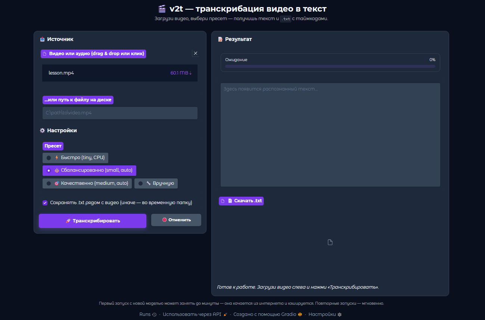
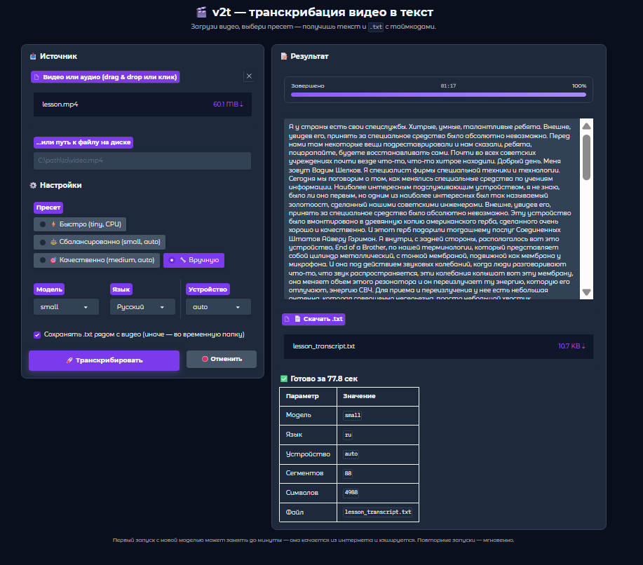

# 🎬 v2t — Video to Text

Простая утилита для транскрибации видео в текст. Работает локально, поддерживает CUDA.

<p align="center">
  
</p>

<p align="center">
  
</p>

---

## Возможности

- 🖥️ **Графический интерфейс** в браузере (Gradio) — открывается одним кликом
- ⌨️ **Командная строка** — для тех, кто любит автоматизацию
- 🚀 **GPU-ускорение** через CUDA (опционально, с автоматическим fallback на CPU)
- 🎯 **Пресеты** «быстро / сбалансированно / качественно» — не надо думать про модели
- 📝 **Таймкоды** в результате — каждая фраза с точностью до секунды
- 📄 **Сохранение рядом с видео** или во временную папку — на выбор
- 🌍 **10 языков** + автодетект
- 📦 **Portable** — ffmpeg лежит внутри проекта, ничего ставить отдельно не надо

---

## Установка

### Что нужно

- **Windows 10/11**
- **Python 3.10 – 3.12** ([скачать](https://www.python.org/downloads/))  
  ⚠️ При установке обязательно отметь галочку **«Add Python to PATH»**
- **ffmpeg.exe** — положить в `ffmpeg/bin/` (см. ниже)
- *(опционально)* **NVIDIA GPU** с актуальными драйверами — ускорит транскрибацию в 5–10 раз

### Шаги

1. Скачай репозиторий:
``` 
git clone https://github.com/acidkil1/v2t.git
cd v2t
```

Или просто скачай ZIP и распакуй.

2. Скачай [ffmpeg essentials build](https://www.gyan.dev/ffmpeg/builds/) (`ffmpeg-release-essentials.zip`), распакуй и положи `ffmpeg.exe` в `v2t/ffmpeg/bin/`:
``` 
v2t/
└── ffmpeg/
└── bin/
└── ffmpeg.exe
```


3. Запусти `install.bat` двойным кликом. Он:
- проверит, что Python в PATH
- создаст виртуальное окружение `venv/`
- поставит зависимости (faster-whisper, gradio и т.д.)

Займёт 2–5 минут в зависимости от скорости интернета.

4. *(Опционально)* **Включить GPU-ускорение.**  
   Если у тебя NVIDIA-видеокарта, запусти `enable_gpu.bat` — он поставит CUDA-библиотеки (~600 МБ). Без этого всё работает, но на CPU (в 5–10 раз медленнее).

---

## Использование

### 🖱️ Графический интерфейс (рекомендуется)

Запусти **`start_gui.bat`**. Откроется браузер с интерфейсом на `http://127.0.0.1:7860`.

Что делать:
1. Перетащи видеофайл в поле слева (или вставь путь вручную).
2. Выбери пресет:
- ⚡ **Быстро** — модель `tiny`, CPU. Для черновика.
- ⚖️ **Сбалансированно** — модель `small`, auto (GPU если есть). **Рекомендуется.**
- 🎯 **Качественно** — модель `medium`, auto. Если важна точность.
- 🔧 **Вручную** — выбрать модель/язык/устройство самому.
3. Нажми **🚀 Транскрибировать**.
4. Дождись результата — текст появится справа, `.txt` можно скачать снизу.

Для остановки сервера — закрой окно `start_gui.bat` или нажми Ctrl+C.

### ⌨️ Командная строка

```bat
v2t.bat "C:\path\to\video.mp4"
v2t.bat "C:\path\to\video.mp4" --model medium --lang en
v2t.bat "C:\path\to\video.mp4" --device cpu --delete-audio
```

Результат — `video_transcript.txt` рядом с видео (или в `--out`-папке).

### Параметры CLI

| Параметр | По умолчанию | Описание |
|---|---|---|
| `video` | — | Путь к видеофайлу (обязательный) |
| `--model` | `small` | Модель: `tiny` / `base` / `small` / `medium` / `large-v3` |
| `--lang` | `ru` | Язык: `ru` / `en` / `auto` / … |
| `--device` | `auto` | `auto` / `cuda` / `cpu` |
| `--out` | рядом с видео | Папка для `.ogg` и `_transcript.txt` |
| `--delete-audio` | выкл | Удалить промежуточный `.ogg` после обработки |

---

## Требования

| | Минимум | Рекомендуется |
|---|---|---|
| ОС | Windows 10 | Windows 11 |
| Python | 3.10 | 3.12 |
| RAM | 4 ГБ | 8+ ГБ |
| Диск | ~1 ГБ (модель + зависимости) | 2+ ГБ |
| GPU | — | NVIDIA с CUDA 12.x |
| VRAM (для GPU) | 2 ГБ | 4+ ГБ |

---

## Как это работает

1. **ffmpeg** извлекает аудио из видео в формат Opus 12 kbps mono — компактно и достаточно для распознавания.
2. **[faster-whisper](https://github.com/SYSTRAN/faster-whisper)** (реализация Whisper от OpenAI на CTranslate2) транскрибирует аудио. На GPU работает в 5–10× быстрее, чем оригинальный Whisper.
3. Результат сохраняется в `.txt` с таймкодами вида `[12.34s -> 15.67s] текст фразы`.

Модели качаются автоматически при первом использовании в `%USERPROFILE%\.cache\huggingface`. Повторные запуски — мгновенно.

---

## Частые проблемы

**CUDA не заводится, ошибка `cublas64_12.dll is not found or cannot be loaded`**

Запусти `enable_gpu.bat` — он поставит CUDA-библиотеки в venv. После этого v2t сам скопирует их рядом с `python.exe` и предзагрузит. При следующем запуске должна появиться строка `[i] Используется GPU (CUDA)`.

Если ошибка осталась:
- Проверь, что у тебя NVIDIA GPU: `nvidia-smi` в консоли.
- Обнови драйверы NVIDIA: https://www.nvidia.com/Download/index.aspx
- Если GPU старый (до CUDA 12.x) — использовать GPU не получится, работа пойдёт на CPU. Это нормально, просто медленнее.

**Долгая загрузка при первом запуске**  
Это качается модель (~500 МБ для `small`, ~1.5 ГБ для `large-v3`). Второй запуск — мгновенно.

**Порт 7860 занят**  
Кто-то ещё запустил Gradio. Открой `app_gradio.py`, найди `server_port=7860` и поменяй на `7861` или любой свободный.

**`v2t.bat` не запускается из PowerShell**  
PowerShell требует явный путь: `.\v2t.bat "video.mp4"`. Или запусти из cmd.exe.

**Антивирус ругается на ffmpeg.exe**  
Ложное срабатывание (ffmpeg — стандартный инструмент). Добавь в исключения или используй системный ffmpeg из PATH.

---

## Структура проекта

```
v2t/
├── v2t.py                # ядро: extract_audio, get_model, transcribe
├── v2t.bat               # CLI-обёртка
├── app_gradio.py         # веб-интерфейс
├── enable_gpu.bat          # установка CUDA-библиотек (опционально)
├── start_gui.bat         # запуск GUI
├── install.bat           # установка venv + зависимостей
├── requirements.txt
├── ffmpeg/bin/ffmpeg.exe # portable ffmpeg
└── screenshots/          # скриншоты для README
```

---

## Лицензия

MIT — делай что хочешь, только не судись.